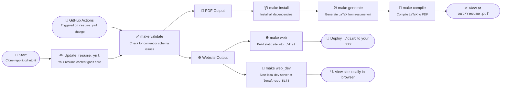

<h1 align="center">Yevhen Mionchynskyy - CV</h1>

<i>This repo contains the source for my personal CV</i>
 
<i>A website (Svelte) and PDF (LaTeX) auto-built from jsonresume data</i>
 
<b>📄 <a href="https://github.com/emionch/cv/releases/latest"><code>Yevhen-Mionchynskyy-CV.pdf</code></a></b>  

## Motive

To automate my CV generation, and make it easier to maintain.
All content is defined in YAML, then a script generates a LaTeX PDF and deploys a web version.
No more wrestling with Microsoft Word — update one file, and every format rebuilds itself.

---

## About

The resume content is defined in [`resume.yml`](/resume.yml) following the [jsonresume.org](https://jsonresume.org/) standard, and validated against [`schema.json`](/schema.json).
A LaTex document is then generated from [`template.jinja`](/template.jinja) formated with [`resume-format.cls`](/tex/resume-format.cls), which is then [compiled into a PDF](https://github.com/emionch/cv/actions/workflows/compile.yml) by GitHub Actions, and published under the [Releases](https://github.com/emionch/cv/releases) tab.
A markdown version is also generated by [`lib/markdown.py`](/lib/markdown.py), as well as a CV website which is built as a static site with SvelteKit, and deployed to GitHub Pages.

Why? ...Because why spend 30 minutes writing your CV, when you could spend 30 hours automating it, obviously!

---

## Usage

### Option #1 - GitHub
1. Fork the repo
2. Update resume.yml with your own content
3. Create [a tag](/.github/workflows/tag.yml), or trigger the GH actions workflow
4. ....and a PDF and website gets magically generated
5. View the PDF in the [Releases](https://github.com/emionch/cv/releases) tab, and the website source in the [`website`](https://github.com/emionch/cv/tree/website) branch, or deployed to GitHub Pages

---

### Option #2 - Local
See the [`Makefile`](/Makefile) for all the available commands. Or, just run `make` from the root, to install deps, validate content, generate LaTex, and compile PDF

1. Clone the repo
2. Update resume.yml with your own content
1. Run `make` from the root, to install deps, validate content, generate LaTex, and compile PDF

Or, to deploy the web version
1. Follow steps above (clone, edit, validate)
2. Run `make web` to generate `dist/`
3. upload to any CDN, web server or static hosting provider

Commands

- `make install` - Download dependencies
- `make validate` - Validate content
- `make generate` - Generate LaTex
- `make compile` - Compile PDF
- `make clean` - Remove generated files
- `make watch` - Watch for changes, recompile and refresh
- `make web` - Launches web version, installs NPM deps, builds and serves the site

---

## Editing
Modify data by editing [`resume.yml`](/resume.yml) 
If you need to customize the layout, edit [`template.jinja`](/template.jinja) 
Or to change the styles and formatting, edit [`resume-format.cls`](/tex/resume-format.cls) 
All the scripts used to generate output are located in [`lib/`](/lib/) 
These are triggered either by the [`Makefile`](/Makefile) or via GitHub Actions with the [`workflows/`](/.github/workflows) 
The source for the website version is located in [`web/`](/web)

---

## Screenshot

<h3 align="center">PDF 📄</h3>

---

## Status

| Workflow     | Description      | Status                     |
| :----------- | :--------------- | :------------------------: |
| `tag`        | Creates a new Git tag. Optionally specify the tag name and description, or by default it will just bump the sem ver patch number by 1 |   |
| `compile`   | Generates the resume in PDF form as an artifact. If triggered by a tag, then a new release will be created, with the PDF attached   |  |
| `validate`   | Validates the resume data against the schema. This also runs whenever a new PR is opened, to ensure it's valid and working |  |
| `build-site` | Compiles the web version as a SvelteKit interactive résumé site, and deploys it |  |

---

## Credits

Built on the excellent [Lissy93/cv](https://github.com/Lissy93/cv) template by [Alicia Sykes](https://github.com/Lissy93), which is licensed under MIT.
The LaTeX class in [`tex/`](/tex) remains her work, and keeps its original attribution.

---

## License

> _**[emionch/cv](https://github.com/emionch/cv)** is licensed under [MIT](https://github.com/emionch/cv/blob/HEAD/LICENSE) © Yevhen Mionchynskyy 2026._ 
> _Based on [Lissy93/cv](https://github.com/Lissy93/cv), MIT © Alicia Sykes._ 
> For information, see <a href="https://tldrlegal.com/license/mit-license">TLDR Legal > MIT</a>
